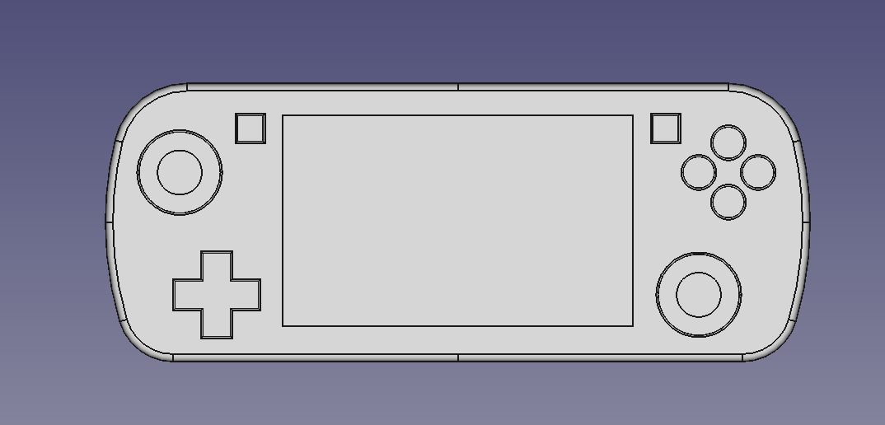

# The Handheld One
An Open Source Gaming Handheld concept initially based on the AM62P.

## Features
- Quad 64-bit Arm® Cortex®-A53 1.4 GHz
- GPU: IMG BXS-4-64 with 256KB cache
- OpenGL ES3.2 and Vulkan 1.2 API support
- Hall Effect Joysticks and Shoulder Triggers
- Top left analog stick layout
- 4.3 Inch 800x480 MIPI Capacitive Touch Display
- m.2 Wifi 5 / Bluetooth
- 60000 mAh Battery
- Pocketable Design
- Fully Open Source

## Modeling Software
[FreeCAD](https://www.freecad.org/)
Models were generated using FreeCad in an attempt to keep this project as open as possible.

